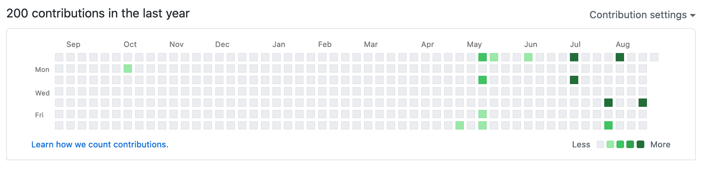
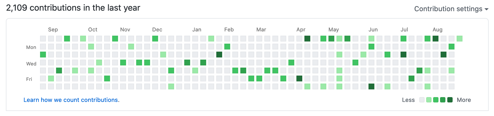

# Github Stats Filler

This projected started out as a joke, but it became an interesting exercise.

The project contains a function (`fill-past-week.js`) that makes a random number of commits (and push) for a random day of the week in a given github repository. This way the
contribution graph will be filled with commits.

*Before*

*After*

The repository also has a function (`fill-past-year`) that will fill the past 12 months with commits every week, and a
`serverless.yml` that will deploy a lambda function to execute the `fill-past-week.js` every Sunday night.

There's a `./go` script to help to execute the functions and deploying to AWS.

To configure your own targeted repository, you need to copy the [secrets](src/secrets.template.json) file, rename it to `secrets.json` and configure it
with your values.
